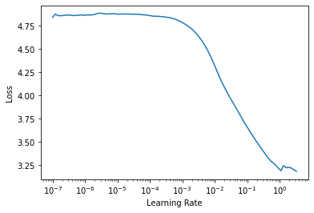
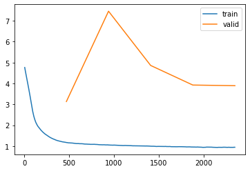

# The Ashrae project
> Building models for the Ashrae prediction challenge.


## Configuring

Defining wether to process the test set (warning, this alone takes 12+ minutes) and submit the results to kaggel (you will need your credentials set up).

```python
do_test = False
do_submit = True
```

Defining where the csv files are located

```python
data_path = Path("../data")
```

## Loading

```python
csvs = inspection.get_csvs(data_path)
csvs
```


    {'building': Path('../data/building_metadata.csv'),
     'sample_submission': Path('../data/sample_submission.csv'),
     'test': Path('../data/test.csv'),
     'train': Path('../data/train.csv'),
     'weather_test': Path('../data/weather_test.csv'),
     'weather_train': Path('../data/weather_train.csv')}


```python
%%time
train = inspection.get_core_Xy(csvs['train'])
display(train.head(), train.info())
```

    <class 'pandas.core.frame.DataFrame'>
    RangeIndex: 20216100 entries, 0 to 20216099
    Data columns (total 4 columns):
     #   Column         Dtype         
    ---  ------         -----         
     0   building_id    uint16        
     1   meter          uint8         
     2   timestamp      datetime64[ns]
     3   meter_reading  float32       
    dtypes: datetime64[ns](1), float32(1), uint16(1), uint8(1)
    memory usage: 289.2 MB


<div>
<style scoped>
    .dataframe tbody tr th:only-of-type {
        vertical-align: middle;
    }

    .dataframe tbody tr th {
        vertical-align: top;
    }

    .dataframe thead th {
        text-align: right;
    }
</style>
<table border="1" class="dataframe">
  <thead>
    <tr style="text-align: right;">
      <th></th>
      <th>building_id</th>
      <th>meter</th>
      <th>timestamp</th>
      <th>meter_reading</th>
    </tr>
  </thead>
  <tbody>
    <tr>
      <th>0</th>
      <td>0</td>
      <td>0</td>
      <td>2016-01-01</td>
      <td>0.0</td>
    </tr>
    <tr>
      <th>1</th>
      <td>1</td>
      <td>0</td>
      <td>2016-01-01</td>
      <td>0.0</td>
    </tr>
    <tr>
      <th>2</th>
      <td>2</td>
      <td>0</td>
      <td>2016-01-01</td>
      <td>0.0</td>
    </tr>
    <tr>
      <th>3</th>
      <td>3</td>
      <td>0</td>
      <td>2016-01-01</td>
      <td>0.0</td>
    </tr>
    <tr>
      <th>4</th>
      <td>4</td>
      <td>0</td>
      <td>2016-01-01</td>
      <td>0.0</td>
    </tr>
  </tbody>
</table>
</div>


    None


    CPU times: user 7.72 s, sys: 2.95 s, total: 10.7 s
    Wall time: 10.7 s


```python
%%time
if do_test:
    test = inspection.get_core_Xy(csvs['test'])
    display(test.head(), test.info())
```

    CPU times: user 0 ns, sys: 0 ns, total: 0 ns
    Wall time: 4.53 µs


```python
%%time
building = inspection.get_building_X(csvs['building'])
display(building.head(), building.info())
```

    <class 'pandas.core.frame.DataFrame'>
    RangeIndex: 1449 entries, 0 to 1448
    Data columns (total 6 columns):
     #   Column       Non-Null Count  Dtype   
    ---  ------       --------------  -----   
     0   site_id      1449 non-null   uint8   
     1   building_id  1449 non-null   uint16  
     2   primary_use  1449 non-null   category
     3   square_feet  1449 non-null   uint32  
     4   year_built   675 non-null    float32 
     5   floor_count  355 non-null    float32 
    dtypes: category(1), float32(2), uint16(1), uint32(1), uint8(1)
    memory usage: 23.5 KB


<div>
<style scoped>
    .dataframe tbody tr th:only-of-type {
        vertical-align: middle;
    }

    .dataframe tbody tr th {
        vertical-align: top;
    }

    .dataframe thead th {
        text-align: right;
    }
</style>
<table border="1" class="dataframe">
  <thead>
    <tr style="text-align: right;">
      <th></th>
      <th>site_id</th>
      <th>building_id</th>
      <th>primary_use</th>
      <th>square_feet</th>
      <th>year_built</th>
      <th>floor_count</th>
    </tr>
  </thead>
  <tbody>
    <tr>
      <th>0</th>
      <td>0</td>
      <td>0</td>
      <td>Education</td>
      <td>7432</td>
      <td>2008.0</td>
      <td>NaN</td>
    </tr>
    <tr>
      <th>1</th>
      <td>0</td>
      <td>1</td>
      <td>Education</td>
      <td>2720</td>
      <td>2004.0</td>
      <td>NaN</td>
    </tr>
    <tr>
      <th>2</th>
      <td>0</td>
      <td>2</td>
      <td>Education</td>
      <td>5376</td>
      <td>1991.0</td>
      <td>NaN</td>
    </tr>
    <tr>
      <th>3</th>
      <td>0</td>
      <td>3</td>
      <td>Education</td>
      <td>23685</td>
      <td>2002.0</td>
      <td>NaN</td>
    </tr>
    <tr>
      <th>4</th>
      <td>0</td>
      <td>4</td>
      <td>Education</td>
      <td>116607</td>
      <td>1975.0</td>
      <td>NaN</td>
    </tr>
  </tbody>
</table>
</div>


    None


    CPU times: user 31.2 ms, sys: 0 ns, total: 31.2 ms
    Wall time: 44.2 ms


```python
%%time
weather_train = inspection.get_weather_X(csvs['weather_train'])
display(weather_train.head(), weather_train.info())
```

    <class 'pandas.core.frame.DataFrame'>
    RangeIndex: 139773 entries, 0 to 139772
    Data columns (total 9 columns):
     #   Column              Non-Null Count   Dtype         
    ---  ------              --------------   -----         
     0   site_id             139773 non-null  int64         
     1   timestamp           139773 non-null  datetime64[ns]
     2   air_temperature     139718 non-null  float64       
     3   cloud_coverage      70600 non-null   float64       
     4   dew_temperature     139660 non-null  float64       
     5   precip_depth_1_hr   89484 non-null   float64       
     6   sea_level_pressure  129155 non-null  float64       
     7   wind_direction      133505 non-null  float64       
     8   wind_speed          139469 non-null  float64       
    dtypes: datetime64[ns](1), float64(7), int64(1)
    memory usage: 9.6 MB


<div>
<style scoped>
    .dataframe tbody tr th:only-of-type {
        vertical-align: middle;
    }

    .dataframe tbody tr th {
        vertical-align: top;
    }

    .dataframe thead th {
        text-align: right;
    }
</style>
<table border="1" class="dataframe">
  <thead>
    <tr style="text-align: right;">
      <th></th>
      <th>site_id</th>
      <th>timestamp</th>
      <th>air_temperature</th>
      <th>cloud_coverage</th>
      <th>dew_temperature</th>
      <th>precip_depth_1_hr</th>
      <th>sea_level_pressure</th>
      <th>wind_direction</th>
      <th>wind_speed</th>
    </tr>
  </thead>
  <tbody>
    <tr>
      <th>0</th>
      <td>0</td>
      <td>2016-01-01 00:00:00</td>
      <td>25.0</td>
      <td>6.0</td>
      <td>20.0</td>
      <td>NaN</td>
      <td>1019.7</td>
      <td>0.0</td>
      <td>0.0</td>
    </tr>
    <tr>
      <th>1</th>
      <td>0</td>
      <td>2016-01-01 01:00:00</td>
      <td>24.4</td>
      <td>NaN</td>
      <td>21.1</td>
      <td>-1.0</td>
      <td>1020.2</td>
      <td>70.0</td>
      <td>1.5</td>
    </tr>
    <tr>
      <th>2</th>
      <td>0</td>
      <td>2016-01-01 02:00:00</td>
      <td>22.8</td>
      <td>2.0</td>
      <td>21.1</td>
      <td>0.0</td>
      <td>1020.2</td>
      <td>0.0</td>
      <td>0.0</td>
    </tr>
    <tr>
      <th>3</th>
      <td>0</td>
      <td>2016-01-01 03:00:00</td>
      <td>21.1</td>
      <td>2.0</td>
      <td>20.6</td>
      <td>0.0</td>
      <td>1020.1</td>
      <td>0.0</td>
      <td>0.0</td>
    </tr>
    <tr>
      <th>4</th>
      <td>0</td>
      <td>2016-01-01 04:00:00</td>
      <td>20.0</td>
      <td>2.0</td>
      <td>20.0</td>
      <td>-1.0</td>
      <td>1020.0</td>
      <td>250.0</td>
      <td>2.6</td>
    </tr>
  </tbody>
</table>
</div>


    None


    CPU times: user 93.8 ms, sys: 0 ns, total: 93.8 ms
    Wall time: 105 ms


```python
%%time
if do_test:
    weather_test = inspection.get_weather_X(csvs['weather_test'])
    display(weather_test.head(), weather_test.info())
```

    CPU times: user 0 ns, sys: 0 ns, total: 0 ns
    Wall time: 7.15 µs


## Building features

```python
process_config = dict(
    add_time_features = True,
    add_dep_var_stats = True,
    df_building = building,
    df_weather = weather_train
)
process = preprocessing.Processor()
```

```python
%%time
df, var_names = process(train.copy(), 
                        **process_config)
```

    CPU times: user 23.5 s, sys: 33.7 s, total: 57.1 s
    Wall time: 56 s


```python
%%time
if do_test:
    df_test, _ = process(test.copy(), 
                         **process_config)
```

    CPU times: user 0 ns, sys: 0 ns, total: 0 ns
    Wall time: 8.34 µs


## Sampling from `df`

```python
%%time
n = len(df)

if True: # per building_id and meter sampling
    n_sample_per_bid = 500
    replace = True

    df = (df.groupby(['building_id', 'meter'])
         .sample(n=n_sample_per_bid, replace=replace))

if False: # general sampling
    frac_samples = .05
    replace = False

    df = (df.sample(frac=frac_samples, replace=replace))

print(f'using {len(df)} samples = {len(df)/n*100:.2f} %')
```

    using 1190000 samples = 5.89 %
    CPU times: user 17.9 s, sys: 2.84 s, total: 20.7 s
    Wall time: 20.8 s


## Preparing the data for modelling

```python
%%time
split_kind = 'random'
#split_kind = 'time'
splits = modelling.split_dataset(df, split_kind=split_kind, train_frac=.8)
#splits=None
```

    CPU times: user 359 ms, sys: 0 ns, total: 359 ms
    Wall time: 377 ms


```python
%%time
to = preprocessing.get_tabular_object(df, var_names, splits=splits)
```

    CPU times: user 8.83 s, sys: 875 ms, total: 9.7 s
    Wall time: 9.76 s


```python
%%time
train_bs = 256*8
val_bs = 256*8

dls = to.dataloaders(bs=train_bs, val_bs=val_bs)
```

    CPU times: user 78.1 ms, sys: 93.8 ms, total: 172 ms
    Wall time: 217 ms


```python
%%time
test_bs = 1024*4

if do_test:
    test_dl = dls.test_dl(df_test, bs=test_bs) 
```

    CPU times: user 0 ns, sys: 0 ns, total: 0 ns
    Wall time: 4.77 µs


## Training a neural net using `tabular_learner`

```python
y_range = [0,
           np.max([to.train.ys.values.max(), 
                   to.valid.ys.values.max()]),]
y_range
```


    [0, 16.900833]


```python
layers = [50, 25, 12]

config = tabular_config(embed_p=.1, ps = [.1, .1, .1])

learn = tabular_learner(dls, y_range=y_range, layers=layers,
                        n_out=1, config=config, 
                        loss_func=modelling.evaluate_torch)
```

```python
learn.lr_find()
```


    SuggestedLRs(lr_min=0.33113112449646, lr_steep=0.009120108559727669)





```python
learn.fit_one_cycle(5, lr_max=1e-2)
```


<table border="1" class="dataframe">
  <thead>
    <tr style="text-align: left;">
      <th>epoch</th>
      <th>train_loss</th>
      <th>valid_loss</th>
      <th>time</th>
    </tr>
  </thead>
  <tbody>
    <tr>
      <td>0</td>
      <td>1.174356</td>
      <td>3.134203</td>
      <td>01:35</td>
    </tr>
    <tr>
      <td>1</td>
      <td>1.053987</td>
      <td>7.457788</td>
      <td>02:16</td>
    </tr>
    <tr>
      <td>2</td>
      <td>0.996315</td>
      <td>4.860970</td>
      <td>02:24</td>
    </tr>
    <tr>
      <td>3</td>
      <td>0.959582</td>
      <td>3.924056</td>
      <td>02:23</td>
    </tr>
    <tr>
      <td>4</td>
      <td>0.946013</td>
      <td>3.892275</td>
      <td>02:22</td>
    </tr>
  </tbody>
</table>


```python
learn.recorder.plot_loss()
```





## Inspecting the predictions

### Basic score

```python
%%time
y_valid_pred, y_valid_true = learn.get_preds()
```


    CPU times: user 8.25 s, sys: 2.97 s, total: 11.2 s
    Wall time: 5.16 s


```python
%%time
if do_test:
    y_test_pred, _ = learn.get_preds(dl=test_dl)
    y_test_pred = cnr(y_test_pred)
```

    CPU times: user 0 ns, sys: 0 ns, total: 0 ns
    Wall time: 18.6 µs


```python
nb_score = modelling.evaluate_torch(y_valid_true, 
                                    y_valid_pred).item()
print(f'fastai loss {nb_score:.4f}')
```

    fastai loss 3.9323


```python
y_valid_pred, y_valid_true = modelling.cnr(y_valid_pred), modelling.cnr(y_valid_true)
```

### Histogram of  `dep_var`

```python
preprocessing.hist_plot_preds(modelling.pick_random(y_valid_true), 
                              modelling.pick_random(y_valid_pred), 
                              label0='truth', label1='prediction')
```

```python
if do_test:
    preprocessing.hist_plot_preds(modelling.pick_random(y_valid_true), 
                                  modelling.pick_random(y_test_pred), 
                                  label0='truth (validation)', 
                                  label1='prediction (test set)').show()
```

### Confidently wrong predictions by `building_id`

```python
%%time
bwt = preprocessing.BoldlyWrongTimeseries(to.valid.xs, y_valid_true, y_valid_pred,
                                          t=df.iloc[splits[1]].loc[:,['timestampElapsed']].copy())
```

    CPU times: user 1.55 s, sys: 344 ms, total: 1.89 s
    Wall time: 1.93 s


```python
bwt.run_boldly()
```

## Submission

```python
%%time
if do_test:
    y_test_pred_original = torch.exp(tensor(y_test_pred)) - 1

    y_out = pd.DataFrame(cnr(y_test_pred_original),
                         columns=['meter_reading'],
                         index=df_test.index)
    display(y_out.head())

    assert len(y_out) == 41697600
```

```python
%%time
if do_submit:
    y_out.to_csv(data_path/'my_submission.csv')
```

```python
# message = ['random forest', '500 obs/bid', 'all features', f'nb score {nb_score:.4f}']
message = ['lightgbm', '500 obs/bid', '100 rounds', '42 leaves', 'lr .5', f'nb score {nb_score:.4f}']
# message = ['tabular_learner', '500 obs/bid', 'all features', f'layers {layers}, embed_p .1, ps [.1,.1,.1]', f'nb score {nb_score:.4f}']
message = ' + '.join(message)
message
```

```python
if do_test and do_submit:
    print('Submitting...')
    !kaggle competitions submit -c ashrae-energy-prediction -f '{data_path}/my_submission.csv' -m '{message}'
```
